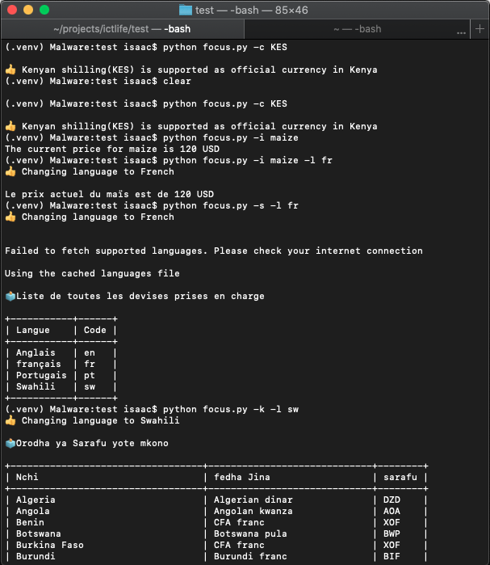

### Focus Mobile Challenge Solution

This is the solution to Focus Mobile Interview Challenge [Question 1](./question1.md)
and [Question 2](./question2.md)

To run the application, follow the following instruction

```bash

$ git clone https://github.com/kipkemei/focus-interview.git
$ cd focus-interview
$ pip install -r requirements.txt
``` 

You can then run the `focus.py` file and supply `--code` or `-c` flag which is the currency code you want to check

```bash
$ python3 focus.py -c KES
```

To get help, 
```bash
$ python3 focus.py -h
```


Show supported currencies 

```$ python focus.py -c KES```

Show price of item 

```$ python focus.py -i maize```

Change display language

```$ python focus.py -l fr```

List supported language 

```$ python focus.py -s```

List supported currencies

```$ python focus.py -k```



